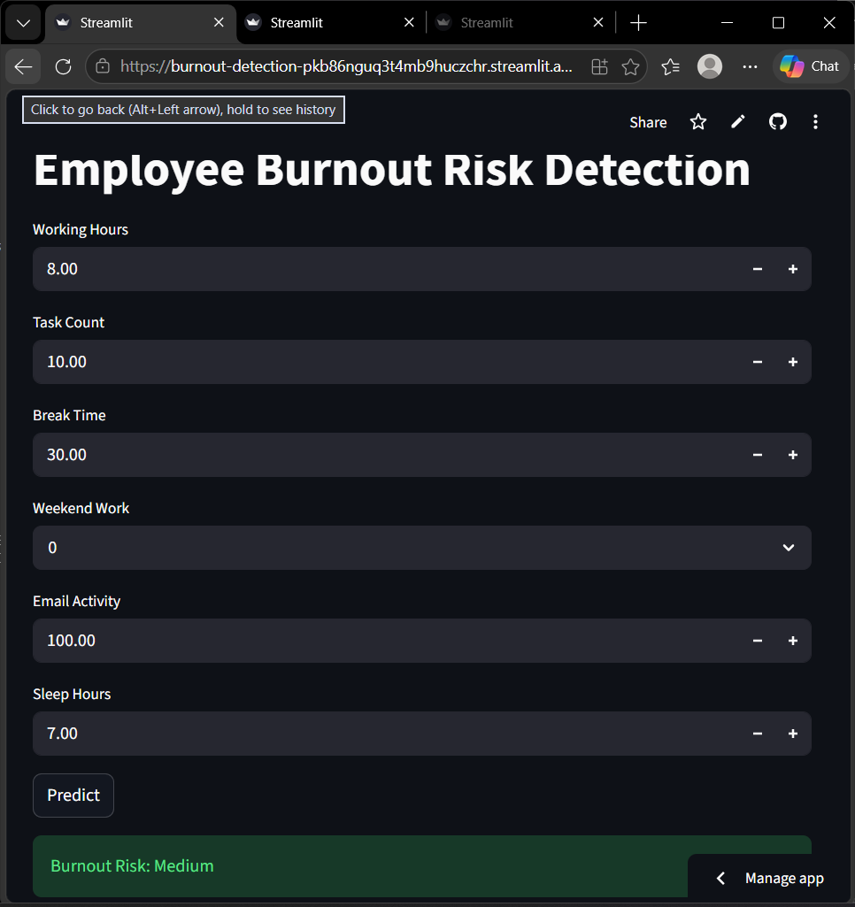

🚀 **Live Demo:** https://burnout-detection-pkb86nguq3t4mb9huczchr.streamlit.app/
# 🔥 Employee Burnout Risk Detection

## 📌 Overview
This project predicts employee burnout risk using machine learning based on work patterns and behavioral data.

## 🚀 Features
- Predicts burnout risk (Low / Medium / High)
- Takes inputs like working hours, tasks, sleep, email activity
- Built with Streamlit web app
- Deployed on cloud

## 🛠️ Tech Stack
- Python
- NumPy
- Scikit-learn
- Streamlit

## 📂 Project Files
- app.py → Main Streamlit app
- model.pkl → Trained ML model
- final_dataset.csv → Dataset used

## ▶️ How to Run
1. Install dependencies:
   pip install streamlit scikit-learn numpy pandas

2. Run the app:
   streamlit run app.py

## 🌐 Live App
https://burnout-detection-pkb86nguq3t4mb9huczchr.streamlit.app/

## 👨‍💻 Author
- Gutha SaiRam Reddy

## 📸 App Preview

